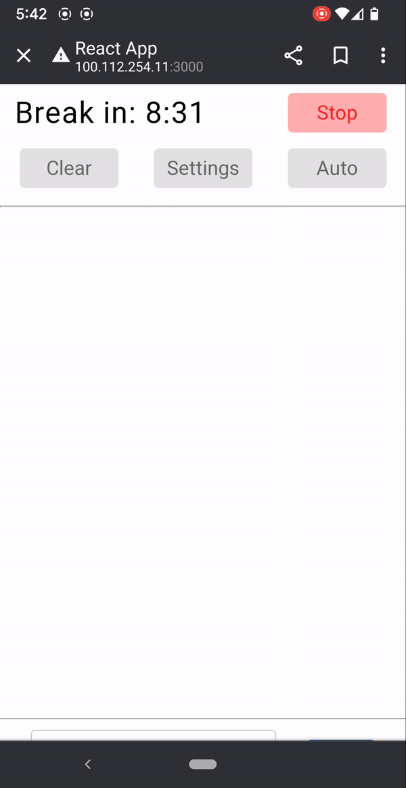
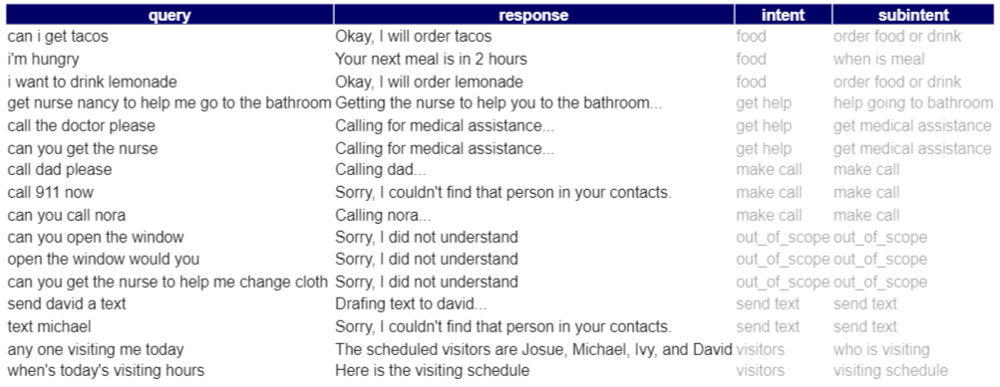

# Chatbot

For ALS patients who have to rely on their caretaker for their day-to-day activities, we want to empower them to have
more autonomy through the assistance of the chatbot. Below we carry out a full-on research to create a chatbot for
hospitalized patients using SoTA deep learning models hosted in Vertex AI. To learn more about the project refer to
https://github.com/NeuroTech-UCSD/Oz-Speller

  

## Abstract

In recent years, the popularity of voice assistants such as Alexa and Siri has grown exponentially, but most are catered
to serve general populations. Voice assistive technology could prove invaluable if properly integrated into the hospital
setting to serve hospitalized patients. To this end, we set about designing a conversational agent capable of
classifying five patient-centric intents: making a call, sending a text, asking about visitors, asking for help, and
asking about food or drink, as well as a category for out-of-scope (OOS) commands. This was accomplished via a two-stage
process: first, by training a few-shot learning (FSL) BERT model on artificially generated data corresponding to each of
the six intents (including the OOS category); and second, by using Facebook’s zero-shot learning (ZSL) model,
bart-large, to further specify the nature of the intent of the patient query. The bart-large model returns the
probability scores for a given set of labels, and the highest-scoring label is selected as the sub-intent. Due to the
nature of this two-stage process, the proposed approach can easily be integrated into standard hospital care pathways,
as the bart-large model does not need to be pre-trained on labeled data. We achieved 99% test accuracy on the intent
classification task, and the second model performed satisfactorily based on the results of manual testing. However,
since our data was self-generated, the BERT model may not generalize well on natural data, which often includes filler
words or blatant violations of grammatical rules. Furthermore, the bot currently only classifies commands into five
meaningful intents, acting as a damper on its functionality. Thus, additional work may be required to fine-tune the
model using real-life data, optimize the value of the confidence threshold, and expand the range of intents it can
handle while maintaining accuracy.

## Research Question
How can we formulate an intelligent bot response based on queries from hospitalized patients?

## Background & Prior Work

Previous studies have shown that a specialized voice assistant could answer many of the basic questions asked by
patients, giving nurses and physicians more time to handle urgent tasks [1]. Furthermore, there have been instances in
which a patient has shown a greater sense of confidence and joy by simply interacting with Alexa [5]. While
state-of-the-art conversational agents such as Google Assistant, Alexa, and Siri have begun gaining a foothold in
improving hospitalized patient’s well-being, these devices cannot be directly employed in the hospitalized setting as
they are not trained for commands specific to the hospitalized patients. For example, “call the nurse to bring some
water” might be a common query from hospitalized patients, but it would not be well-understood by existing voice
assistive technologies. Therefore, the goal of this research is to develop a conversational agent adapted to the
frequent needs of hospitalized patients that formulates intelligent bot responses accordingly.

# Activate docker to work with the rest of the Companion App

* `docker run -e APP_PORT=4002 -e HOST_ADDR=100.112.254.11 ghcr.io/neurotech-ucsd/conversational-agents-for-hospitalized-agents:main`
    * make sure the `APP_PORT` and `HOST_ADDR` are the same for `ssvep-ui` and `OzSpeller`
    * Note that this docker image will stop working after 12/1/2022, as we'll stop hosting our model in VertexAI. You
      can build the image locally then using `Dockerfile`

# To contribute to this repo locally

* `pip install -e .` to activate `setup.py`
* `pip install -r requirements.txt` to download dependencies necessary
* `pip install -r requirements_dev.txt` to download dependencies for the notebook
* `python scripts/download_model.py` to download pretrained layers
* `python scripts/train_model.py` to generate dataset, train model, and save the model to `models` folder
* `python scripts/predict_model.py` to play around with the model
* `python scripts/chatbot.py` to activate the chatbot agent to communicate with server in `OzSpeller`

## Jupyter Notebooks

* Feel free to play around with the Jupyter notebooks for some deeper analysis that covers gated prediction, confusion
  matrix, and how the data is generated

## Host model in Vertex AI (optional)

* You can host your trained model in Vertex AI using the instruction here: https://cloud.google.com/vertex-ai, we're
  currently paying minimum to host the model in Vertex AI but will stop hosting it beginning 12/1/2022

# Methods

## Generate Dataset

Other implementations of conversational agents that generate responses to closed domain tasks have used the Rasa
framework to train a model on sentences with labeled intents and entities [2, 8]. Owing to time limitations and a
shortage of relevant datasets, we elected to create our own labeled artificial dataset using a specialized Python
package called Chatette. Chatette (which is based off of the NLP dataset generator Chatito) generates examples of
sentences corresponding to specific intents based on specific structures and keywords defined by the user [4]. The
programmer provides lists of tags, aliases, and other modifiers that will then be used in various combinations in
custom-defined sentence structures corresponding to specific intents. The intent labels remain attached to the generated
sentences, and the resultant labeled dataset can then be used to train the model. One of the program’s built-in features
enabled us to manually adjust the probabilities of generating certain sentence structures to minimize imbalance that
would otherwise have arisen in the data (e.g., if the same sentence was generated over and over, with the only
difference being the specific person’s name used). Likewise, in order to ensure that the number of examples generated
for each category was roughly equal, a cap of five hundred examples was set for each intent.

## Modeling

### BERT

BERT (Bidirectional Encoder Representations from Transformers) is a recent paper published by researchers at Google AI
Language. It has caused a stir in the Machine Learning community by presenting state-of-the-art results in a wide
variety of NLP tasks, including Question Answering (SQuAD v1.1), Natural Language Inference (MNLI), and others.

### Bart-Large

The Bart model was proposed by Mike Lewis, Yinhan Liu, Naman Goyal, Marjan Ghazvininejad, Abdelrahman Mohamed, Omer
Levy, Ves Stoyanov and Luke Zettlemoyer on 29 Oct, 2019. According to the abstract, Bart uses a standard seq2seq/machine
translation architecture with a bidirectional encoder (like BERT) and a left-to-right decoder (like GPT).

### Two-Stage Prediction

For each user query, the agent engaged in a multi-stage process to produce an intelligent response. The first component
of the pipeline always involved an intent recognition task that would classify a text-based query into one of six
categories: making a call, sending a text, asking for help, asking about visitors, asking about food, and out-of-scope
queries. This classification was handled using four different approaches, and performance was compared across methods.
Method 1 utilized a BERT model and treated the out-of-scope class as a sixth category, identical to the others, such
that classification was performed in a single run. Methods 2-4 consisted of two distinct steps: first, a classifier was
trained to divide the data based on in-class versus out-of-class (AKA out-of-scope) categories, a process known as
“hardgating”, and then a separate classifier was trained to further sort the in-class examples into one of the five
intent categories. Methods 2-4 all utilized BERT for the hardgating step, but they differed in the model used for the
second step: either BERT, Sentence-BERT (SBERT), or bart-large.

After the general topic had been discerned, stage two of the process enabled the response to be personalized based on
specific entities present in the user’s query, rather than simply generating a blanket response for each of the five
intents. Depending on the intent, this stage could consist of multiple components: further classifying the query into a
sub-intent category, searching the sentence for foods or names present in a list, or some combination of the two.
Bart-large was used universally for the sub-intent classification task, as its zero-shot classification pipeline proved
quite adept at classifying sentences into more specific categories. The model returned confidence scores corresponding
to each of the provided labels, and the label with the highest score was selected as the sub-intent. The final response
was formulated based on pre-written templates for the intent (or subintent) that were then customized with any
additional information extracted in the second stage.

# Demo of results

Please refer to `GUI.ipynb` for more details

# References

[1] Comstock, Jonah  (2019). How a voice assistant can be a constant companion for hospital-bound patients.
Www.Mobihealthnews.Com. https://www.mobihealthnews.com/news/how-voice-assistant-can-be-constant-companion-hospital-bound-patients  
[2] Bhattacharyya, S., Ray, S., & Dey, M. (2020). Context-Aware Conversational Agent for a Closed Domain Task. In:
Mandal J., Mukhopadhyay S. (eds) Proceedings of the Global AI Congress 2019. Advances in Intelligent Systems and
Computing, vol 1112. Springer, Singapore. https://doi.org/10.1007/978-981-15-2188-1_24  
[3] Larson, S., Mahendran, A., Peper, J. J., Clarke, C., Lee, A., Hill, P., ... & Mars, J. (2019). An evaluation dataset
for intent classification and out-of-scope prediction. arXiv preprint arXiv:1909.02027.  
[4] SimGus (2018). Chatette: A data generator for Rasa NLU [Electronic resource: Python source code]
. https://github.com/SimGus/Chatette  
[5] How one hospital is incorporating voice assistants into care delivery (2020). www.advisory.com
. https://www.advisory.com/blog/2020/03/voice-assistant-technology  
[6] Mike Lewis, Yinhan Liu, Naman Goyal, Marjan Ghazvininejad, Abdelrahman Mohamed, Omer Levy, Ves Stoyanov, Luke
Zettlemoyer. (2019) BART: Denoising Sequence-to-Sequence Pre-training for Natural Language Generation, Translation, and
Comprehension. arXiv:1910.13461  
[7] Jacob Devlin, Ming-Wei Chang, Kenton Lee, Kristina Toutanova (2018). BERT: Pre-training of Deep Bidirectional
Transformers for Language Understanding. arXiv:1810.04805.  
[8] Braun, D., Hernandez-Mendez, A., Matthes, F., Langen, M. (2017). Evaluating natural language understanding services
for conversational question answering systems. In: SIGDIAL Conference. https://doi.org/10.18653/v1/W17-5522  

